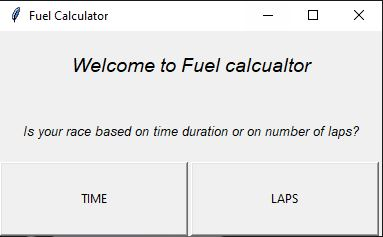
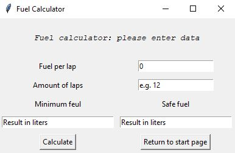

# Fuel-app
> Estimates how much liters of fuel is needed to finish a race in simulator games

## Table of contents
* [General info](#general-info)
* [Screenshots](#screenshots)
* [Technologies](#technologies)
* [Setup](#setup)
* [Features](#features)
* [Status](#status)
* [Inspiration](#inspiration)
* [Contact](#contact)

## General info
App helps to estimate how much fuel is needed to finish a race in games like Assetto Corsa or Assetto Corsa Competizione. 
Especially helpful for long races or races on new tracks.

## Screenshots

## Technologies
* Python - version 3.7
* Tkinter

## Setup
To run this project download the files and type "python main.py" in your consol when having the project's path open. Make sure you have tkinter modul installed.

## Features
List of features ready and TODOs for future development
* Calculate fuel for races based on amount of laps and also amount of time.
* Provides two valuses: minimum fuel required to finish the race and also safe amount.

To-do list:
* Cleaner, more transparent interface 
* Ability to save data for favorite tracks and cars

## Status
Project is in proggress 

## Inspiration
Project created after running out of fuel on last lap of 2 hours race in Assetto Corsa Competizione

## Contact
Created by [@Piotr Kowalewski](https://pkow.herokuapp.com) - feel free to contact me!
